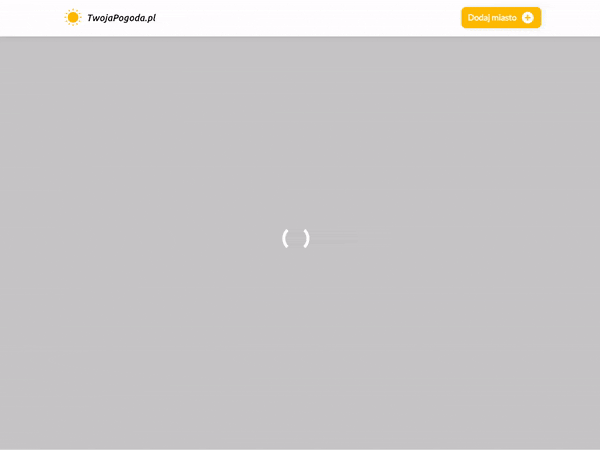

##**Weather App with API**

This project demonstrates the implementation of API with JavaScript page controller.


## Założenia
W aplikacji powinniśmy mieć możliwość odnalezienia współrzędnych konkretnego miejsca i na podstawie tych danych, wyświetlić aktualną i prognozowaną pogodę. Chcemy wyświetlać wszystkie niezbędne informacje:

- Aktualna temperatura
- Wilgotność
- Ciśnienie
- Prędkość wiatru
- Prognoza pogody na 5 dni w przód


W warsztacie tym należy korzystać z wszystkich udogodnień ES6, takich jak deklaracje zmiennych przez `const`, `let`, klasowość `class`, funkcje strzałkowe, `import/export`, `async/await`, `fetch` itd.

## Zasady działania

### Wejście na stronę
Po wejściu na stronę powinniśmy wysłać zapytanie do `Weather API` aby pobrać pogodę dla naszej aktualnej lokalizacji (parametr `q` musi mieć wartość `auto:ip` - jest to opisane niżej) i wyświetlić ją użytkownikowi.




### Dodanie nowego miasta
Na stronie znajduje się przycisk "Dodaj miasto". Po jego kliknięciu powinniśmy wyświetlić ukryta sekcję z formularzem. Po wpisaniu przez użytkownika miasta czy całego adresu należy wykonać zapytanie do `Weather API`, aby pobrać aktualną pogodę i wyświetlić ją użytkownikowi (pole formularza nie może mieć polskich znaków - jest to ograniczenie API). Po pobraniu danych formularz powinien zniknąć.


### Ukrywanie/Usuwanie modułu
Po kliknięciu przycisku "x" w prawym górnym rogu każdego modułu powinniśmy go ukryć. Jeżeli jest to moduł pogodowy, możemy go usunąć ze struktury HTML.


## Przydatne informacje

### Efekt ładowania strony
Wystarczy, że dodacie do elementu `body` klasę `loading` a pojawi się na całym ekranie spinner który możecie zauważyć na nagraniach wyżej. Aby się go pozbyć, wystarczy usunąć klasę `loading` z elementu `body`.


### Ikony
W projekcie mamy zainstalowane ikony pogodowe które znajdziecie w folderze `assets/icons`.  

Dodatkowo możecie używać ikon Material-Icons. Listę tych ikon możecie znaleźć tutaj: [https://material.io/tools/icons](https://material.io/tools/icons).  
Używamy ich za pomocą:

```html
<i class="material-icons">nazwa_ikony</i>
```

## API

### Weather API

**Wymagany jest klucz API!**

API odpowiedzialne za dostarczenie nam aktualnej i prognozowanej pogody.

Należy się zarejestrować, **wygenerować swój klucz** i zapisać go w projekcie.

Pobranie klucza: [https://www.weatherapi.com](https://www.weatherapi.com)  

Pobranie aktualnej pogody i prognozy na 5 dni: 

```
http://api.weatherapi.com/v1/forecast.json?key=twoj_klucz&q=nazwa_miasta_lub_auto:ip&days=5
```

- Pod wartość `twoj_klucz` podstawiamy nasz klucz wygenerowany przez Weather API
- Pod wartość `nazwa_miasta_lub_auto:ip` podstawiamy wartość z pola wyszukiwarki (bez polskich znaków!) lub `auto:ip` aby otrzymać pogodę dla naszej aktualnej lokalizacji


